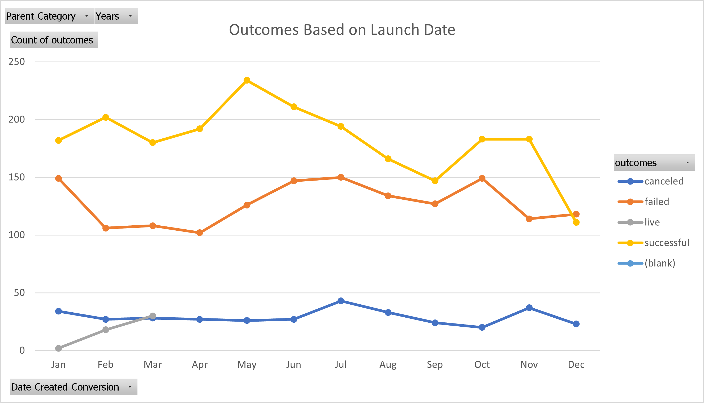
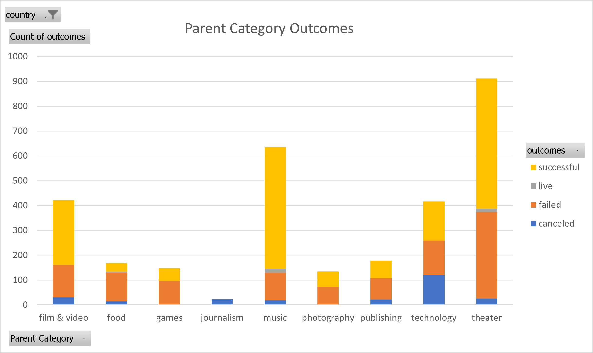
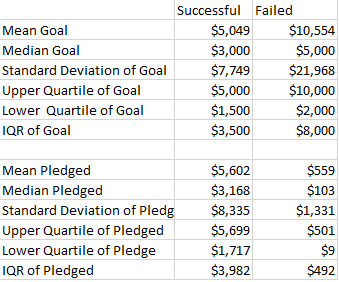
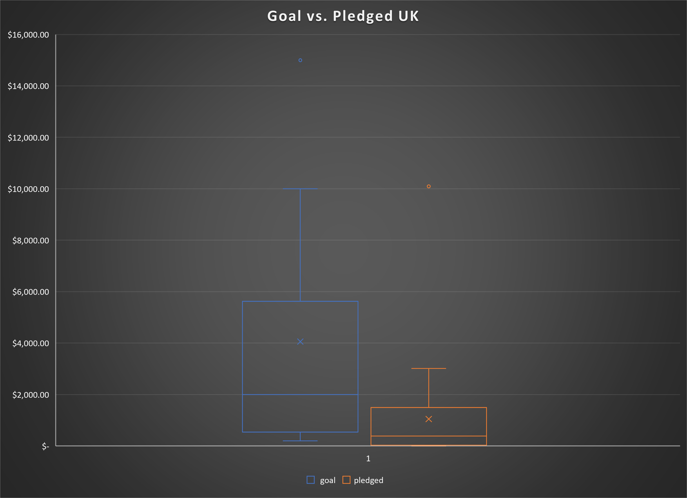

# Kickstarting with Excel

## Overview of Project
  This is a analysis of several Kickstarter campaigns.

### Purpose
  To help Louise plan her campaign to be successful so that she can produce her play 'Fever'.

## Analysis and Challenges

### Analysis of Outcomes Based on Launch Date
  

  The month that launched the most successful Kickstarter campaigns was May. However, January, June, July, and October all had roughly the same number of failed campaigns launched, which can be determined by examining the points along the chart's trend lines.
  
  February has a more significant gap between campaigns that succeeded and failed. That month might mean a better chance at succeeding.

### Analysis of Outcomes Based on Goals
  
  Looking at the data, it looks like a play has a decent chance of succedding.

### Challenges and Difficulties Encountered
  Coming from a more programming and coding background, it was a bit more challenging to find things hidden in menu layers to generate what I wanted.

  I knew what a Unix timestamp was due to my background, and I could see how some people wouldn’t know what that was looking at the set of numbers without encountering it in the past.

### What are some limitations of this dataset?
The data can’t quantify what made a campaign successful or not. For example, was the campaign done by a famous director or actor that has a history of following through this project to completion? Does someone with a good reputation back the campaign?

### What are some other possible tables and/or graphs that we could create?
  
  
